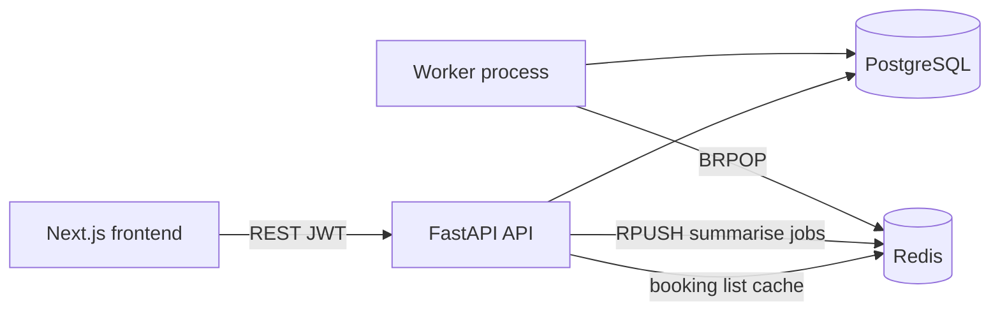

# High-level design (HLD)

Ledger is a service booking and review marketplace. Customers discover providers, request appointments against real availability, and review completed visits. Providers manage services, weekly hours, and booking status.

## System context

## Components

| Component | Responsibility |
|-----------|----------------|
| **Frontend** (`frontend/`) | Marketplace UI, auth session in browser, booking and review flows |
| **API** (`backend/app/`) | REST, JWT auth, RBAC, booking lifecycle, enqueue summarise jobs, cache reads |
| **PostgreSQL** | Source of truth for users, services, availability, bookings, reviews |
| **Redis** | (1) booking-list cache (2) review summarisation queue |
| **Worker** (`backend/worker/`) | `BRPOP` on `jobs:summarise`, stub-fill review/provider summaries |
| **GitHub Actions** | Ruff + pytest (backend), lint + build (frontend) |

## Redis (exactly two uses)

1. **Booking-list cache** — `GET /bookings` responses keyed by `bookings:list:{userId}:{role}:{status}` with short TTL; invalidated on booking/review writes (enumerable key set, no `KEYS`/`SCAN`).
2. **Summarisation queue** — `POST /providers/{id}/reviews/summarise` → `RPUSH` JSON job → worker stub (no real LLM).

## Major flows

### Customer booking

Authenticate → explore/search → provider → pick service + slot → `POST /bookings` (`pending`) → provider confirms → visit → `completed` → `POST /reviews`.

### Provider confirmation

List own bookings → `PATCH` pending → `confirmed` or `cancelled` (decline) → later `completed` / `no_show` / `cancelled`.

### Review summarisation

Owner or admin calls summarise → Redis job → worker writes stub `summary` / `review_summary` on Postgres rows.
