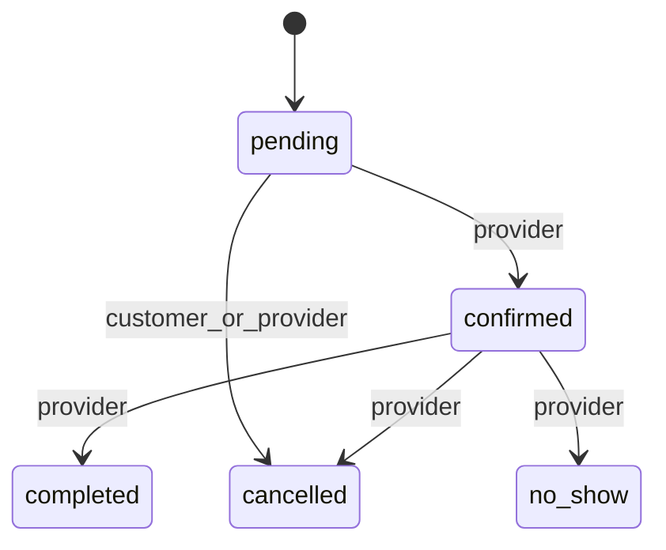

# Low-level design (LLD)

Implementation details drawn from `backend/app/`. Invented endpoints or states are omitted.

## Database (SQLAlchemy models)

| Table | Role |
|-------|------|
| `users` | `admin` / `provider` / `customer`; provider profile fields nullable |
| `services` | Provider offerings: name, duration, `price_cents`, `is_active` |
| `availability_rules` | Weekly windows (`weekday`, start/end time) per provider |
| `bookings` | `provider_id`, `customer_id`, `service_id`, denorm `service_name`, times, status, price |
| `reviews` | One per booking (`booking_id` unique); `author_id`, `provider_id`, rating, comment, stub summary, optional reply |

Migrations: Alembic `001_initial`, `002_premium` under `backend/alembic/versions/`.

## Booking state machine

States: `pending`, `confirmed`, `completed`, `cancelled`, `no_show`.

Provider decline of a pending request is **`cancelled`** (no separate `declined` status).

Enforced in `assert_status_transition` (`backend/app/rbac.py`). Admin may fire any **legal** edge.

## RBAC (`backend/app/rbac.py`)

- `get_current_user` — JWT Bearer → active user
- `require_role(*roles)` — route gate
- `assert_booking_access` — customer only own `customer_id`; provider only own `provider_id`; **admin bypass**
- List scoping in `bookings.py`: customers/providers filtered to self; admin sees all

## API map (important routes)

| Method | Path | Notes |
|--------|------|-------|
| POST | `/auth/register`, `/auth/login` | JWT issued on login |
| GET | `/health` | Liveness |
| POST/GET/PATCH/DELETE | `/bookings`, `/bookings/{id}` | Full booking CRUD |
| POST | `/reviews` | After completed booking |
| PATCH | `/reviews/{id}/reply` | Provider reply |
| GET | `/providers`, `/providers/{id}` | Directory + detail |
| GET/PUT | `/providers/me/availability` | Owner hours |
| GET | `/providers/{id}/slots` | Generated slots |
| GET | `/providers/{id}/reviews`, `.../stats` | Public reviews |
| POST | `/providers/{id}/reviews/summarise` | **202** + enqueue |
| GET/POST | `/providers/{id}/services` | List / create |
| PATCH/DELETE | `/services/{service_id}` | Owner/admin |

## Redis details

| Concern | Actual value |
|---------|----------------|
| Cache key | `bookings:list:{user_id}:{role}:{status}` |
| TTL | `bookings_cache_ttl_seconds` (default **20**) |
| Invalidation | `invalidate_bookings_cache` deletes 12 known keys for customer+provider × status variants |
| Queue key | `jobs:summarise` (`summarise_queue_key`) |
| Enqueue | `RPUSH` JSON `{"job_id","provider_id"}` via `enqueue_summarise_job` |
| Worker | `BRPOP` timeout 5s; stub fills `review.summary` / `provider.review_summary` |

There is **no** provider profile PATCH API; profile fields are set at registration / seed.
