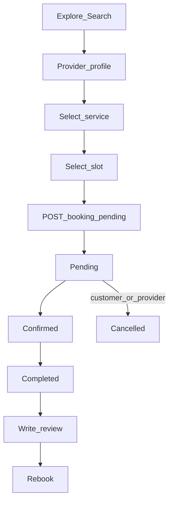
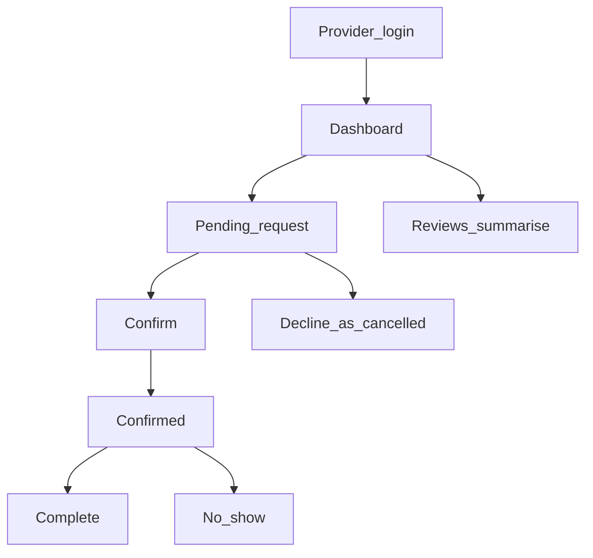
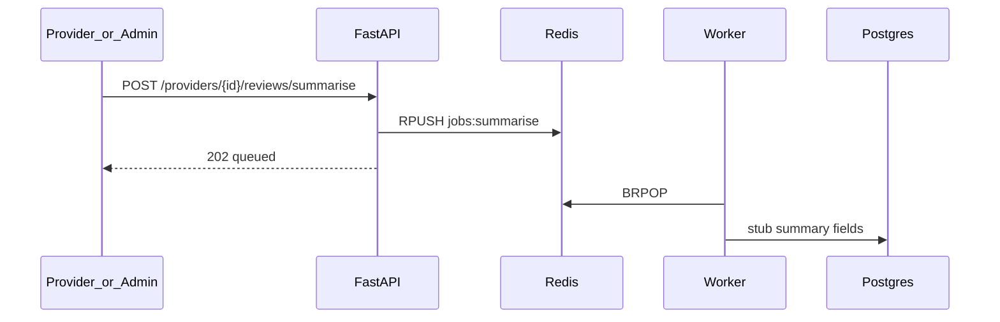
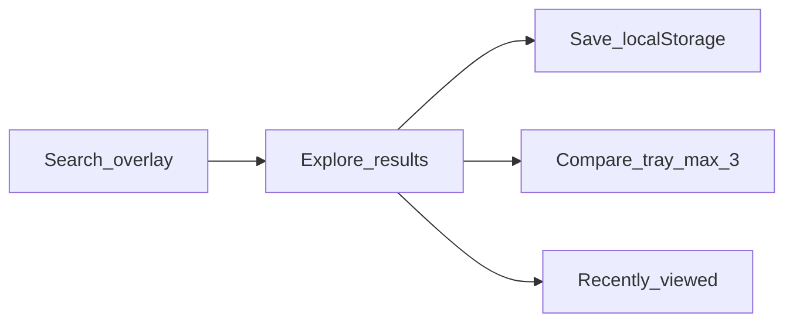

# User flows

Flows mirror the shipped UI and API. States match the backend.

## Customer booking

```mermaid
flowchart TD
  explore[Explore_Search]
  provider[Provider_profile]
  service[Select_service]
  slot[Select_slot]
  request[POST_booking_pending]
  wait[Pending]
  confirmed[Confirmed]
  done[Completed]
  review[Write_review]
  rebook[Rebook]

  explore --> provider --> service --> slot --> request --> wait
  wait --> confirmed --> done --> review --> rebook
  wait -->|customer_or_provider| cancelled[Cancelled]
```

## Provider ops

```mermaid
flowchart TD
  login[Provider_login]
  dash[Dashboard]
  req[Pending_request]
  confirm[Confirm]
  decline[Decline_as_cancelled]
  upcoming[Confirmed]
  complete[Complete]
  noshow[No_show]
  reviews[Reviews_summarise]

  login --> dash --> req
  req --> confirm --> upcoming
  req --> decline
  upcoming --> complete
  upcoming --> noshow
  dash --> reviews
```

## Redis summarisation

```mermaid
sequenceDiagram
  participant P as Provider_or_Admin
  participant API as FastAPI
  participant R as Redis
  participant W as Worker
  participant DB as Postgres

  P->>API: POST /providers/{id}/reviews/summarise
  API->>R: RPUSH jobs:summarise
  API-->>P: 202 queued
  W->>R: BRPOP
  W->>DB: stub summary fields
```

## Discovery helpers (client-side)

```mermaid
flowchart LR
  search[Search_overlay]
  results[Explore_results]
  save[Save_localStorage]
  compare[Compare_tray_max_3]
  recent[Recently_viewed]

  search --> results
  results --> save
  results --> compare
  results --> recent
```
